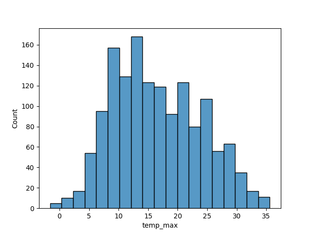

# Part 1
## dataframe.info()
    - prints a table containing the name of the columns
    - the number of rows containing non null values for the given column
    - the type of data found in that column
## dataframe.isnull()
    - prints the entire csv, with "False" instead of non null values or "True" instead of null values
    - prefered to use as ".isnull().sum()" because it shows the number of non null values for each column
## dataframe.duplicated()
    - returns a boolean series where duplicated rows are marked with "True"
    - prefered to use as ".duplicated().sum()" because it shows the number of duplicated rows.
## dataframe.min()
    - minimum of a row -> min(axis = 1)
    - minimum of a column -> min(axis = 0)
    - for columns: returns a series containing the minimum value for each column
    - minimum for a specific column can be found by accessing with series['column_name'], like a python dict
## dataframe["given_column"].value_counts()
    - returns a series with the number of occurences of each value found in "given_column"
## series.iloc[index]
    - used for integer-based indexing of a series. Useful for series with labels of types other than integer
## series.index
    - returns a list of indexes

# Part 2
## sns.hisplot()
    - takes as parameters the dataframe and the name of the column that should be plotted on the x-axis
    - need to call plt.show() to print the plot

## sns.FacetGrid() - max temperature
    - it is initialized with the dataframe and the column
    - used lineplot

## sns.FacetGrid() - precipitation
    - used scatterplot

## sns.countplot() - weather

## plt.pie - weather piechart
